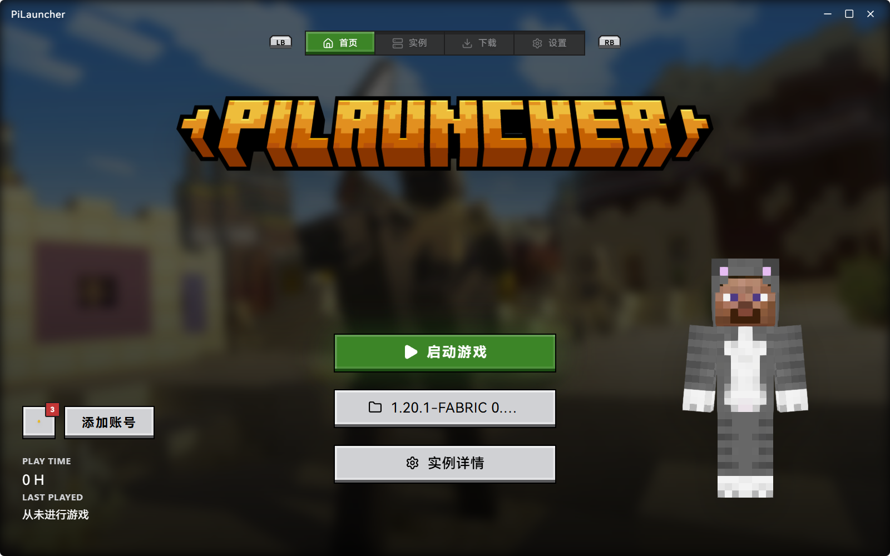
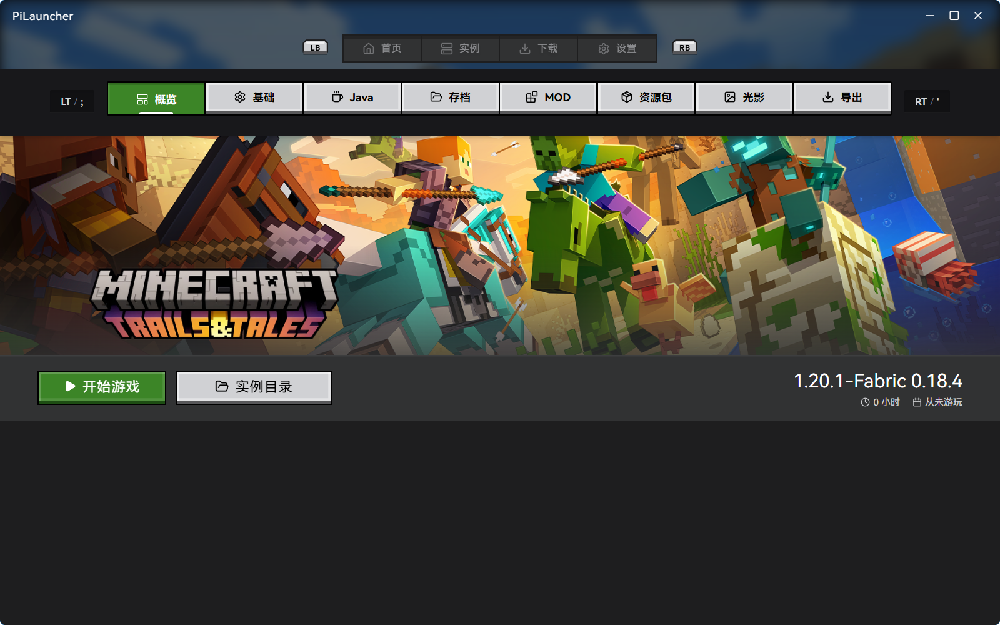
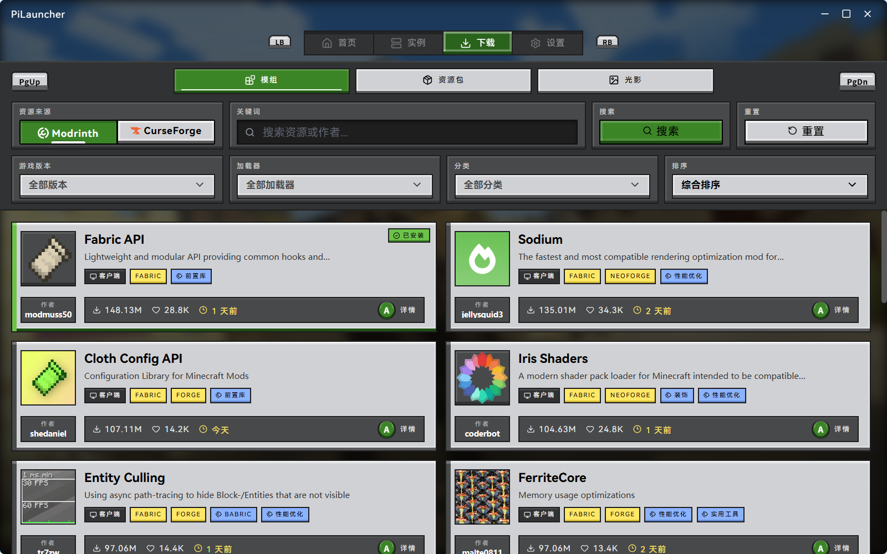
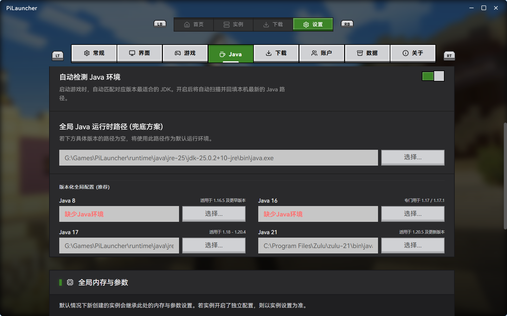

# PiLauncher

> A modern, gamepad-friendly Minecraft launcher built with Tauri + React.

PiLauncher 是一款基于 **Tauri + React + TailwindCSS + Framer Motion** 构建的跨平台 Minecraft 启动器，专为 **SteamDeck 及掌机设备** 优化，同时完整支持鼠标、键盘和手柄操作。

目标是提供一个 **轻量、安全、流畅、可扩展** 的现代启动体验。

## Disclaimer

PiLauncher is an independent third-party Minecraft launcher developed by the community.

This project is **not an official Minecraft product** and is **not approved by or associated with Mojang Studios or Microsoft**.

Minecraft is a trademark of Mojang Studios. All related assets, game content, and trademarks belong to their respective owners.

PiLauncher does not distribute the Minecraft game itself.
Users must own a valid Minecraft license and authenticate with a Microsoft account to play online.

This launcher is provided as a tool to help users manage and launch their Minecraft installations more conveniently.

## Interface Design

The user interface of PiLauncher is inspired by the visual style of the Minecraft launcher interface (often referred to as "Ore UI").

PiLauncher is an independent community project and is not affiliated with Mojang Studios or Microsoft.
The interface design has been recreated from scratch and does not use any official assets.

---

## Screenshots









---
## ✨ Features

### 🎮 Handheld & Gamepad Friendly

* 完整支持手柄操作
* SteamDeck 适配优化
* 专为小屏设备设计的交互布局
* 键盘 / 鼠标 / 手柄统一输入模型


### 🧑‍🚀 3D Player Skin Viewer

* 玩家角色 3D 实时展示
* 支持皮肤渲染
* 支持模型预览（Steve / Alex 等）
* 流畅动画与交互

### 🚀 Cross Platform

* Windows
* Linux
* macOS
* SteamOS / SteamDeck

### 🧩 Instance Management

* 多实例管理
* 模组隔离
* 自定义 JVM 参数
* 版本独立配置

---

## 🛠 Tech Stack

* **Tauri** – Lightweight native wrapper
* **React** – UI framework
* **TailwindCSS** – Utility-first styling
* **Framer Motion** – Fluid animations
* **Rust** – Secure and high-performance backend

---

## 🎯 Design Philosophy

PiLauncher 专注于：

* 极低资源占用
* 掌机设备友好
* 动画流畅
* 结构清晰可扩展
* 不臃肿、不复杂

相比传统 Electron 启动器，PiLauncher 体积更小、内存占用更低、启动更快。

---

## 🖥 SteamDeck Optimization

* 控制器优先交互逻辑
* 适配 1280x800 分辨率
* UI 元素可焦点导航
* 无需外接键鼠即可完整操作

---
---

## 📦 Installation

```bash
# Clone repository
git clone https://github.com/MrShellad/pilauncher.git

# Install dependencies
pnpm install

# Run dev mode
pnpm tauri dev
```

---

## Project Status

PiLauncher is currently in early development and is maintained by the original author.

To keep the project stable during this stage:

* Pull requests are **temporarily not accepted**.
* The repository is published primarily for **transparency and code review**.
* Please avoid creating forks intended for redistribution or derivative launcher projects.

Once the project architecture becomes stable, contribution guidelines may be introduced.

* **严禁售卖：** 禁止以任何形式售卖本软件或其衍生版本。
* **严禁捆绑：** 禁止将 PiLauncher 与任何收费服务、会员制度或订阅项目进行捆绑。