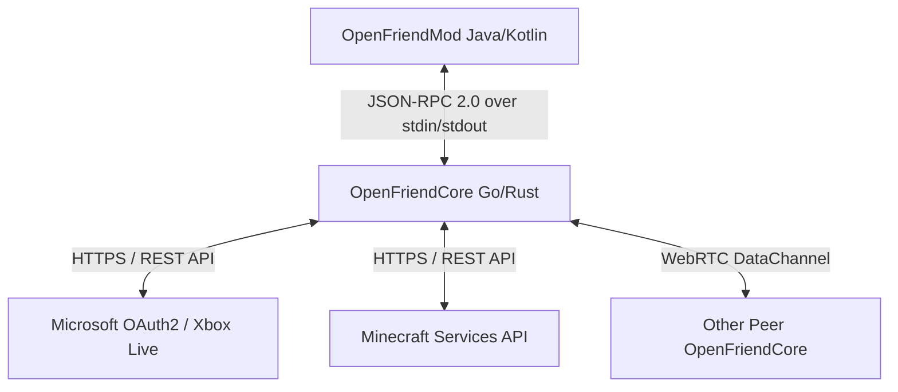

# OpenFriend 好友列表获取机制分析与 Rust 实现设计文档

本文件旨在深入分析 OpenFriend 现有的好友列表拉取机制（基于 Java Mod 与 Go Core 的 IPC 架构），并据此设计一套在 **Rust** 环境下高并发、低延迟实现该后端 Core 的方案。

---

## 1. 架构与拉取流程分析

### 1.1 宏观架构概览

OpenFriend 的整体架构由 **客户端 Mod (Java)** 与 **底层 Core 守护进程 (Go)** 组成：



*   **Java Mod 层**：负责 Minecraft 内部 UI 渲染、Mixin 注入及拦截本地单人世界开启 LAN 事件。Mod 不直接进行任何网络 API 调用，所有操作都委托给 Core 进程。
*   **Core 守护进程**：常驻后台，通过 stdin/stdout 与 Mod 建立双向 IPC 管道。主要处理 MSA 认证、Xbox Live 握手、Mojang Friends 状态同步以及 WebRTC P2P 网络桥接。

---

### 1.2 好友列表拉取流 (Sequence Flow)

当玩家打开 Friends 界面或 Mod 启动初始化完毕时，Java Mod 会发起好友列表查询请求：

```mermaid
sequenceDiagram
    participant Mod as OpenFriendMod (Java)
    participant Core as OpenFriendCore (Go/Rust)
    participant MS as Microsoft / Xbox Live
    participant MC as Minecraft Services API

    Note over Mod, Core: 步骤 1: 认证流 (以设备码登录为例)
    Mod->>Core: auth.signIn (expectedProfileId)
    Core->>MS: 请求设备码 (devicecode)
    MS-->>Core: 返回 user_code, verification_uri
    Core-->>Mod: 发送 auth.deviceCode 通知 (显示在UI)
    Note over Mod, MS: 用户在浏览器中完成授权
    Core->>MS: 轮询登录状态并获取 AccessToken & RefreshToken
    Core->>MS: 进行 Xbox Live & XSTS 认证
    Core->>MC: 使用 XSTS 令牌进行 Minecraft 登录
    MC-->>Core: 返回 Minecraft 证书与 Profile 信息
    Core-->>Mod: 发送 auth.signedIn 通知 (包含 profileId, name)
    Core-->>Mod: auth.signIn 响应 (成功)

    Note over Mod, Core: 步骤 2: 好友列表拉取
    Mod->>Core: friends.list (params: null)
    alt 方法一：使用 Xbox Live 社交图谱
        Core->>MS: GET /users/xuid({xuid})/people/social/...
        MS-->>Core: 返回 Xbox 好友及在线状态
    alt 方法二：使用 Minecraft Services 官方社交 API (26.2+ Snapshot)
        Core->>MC: GET /friends/all (Authorization: Bearer <MC_Token>)
        MC-->>Core: 返回 Minecraft 好友 ProfileUUID 及 Name
    end
    Core-->>Mod: 响应 friends.list (friends, incoming, outgoing)
```

---

### 1.3 关键 REST API 细节

为了在 Rust 中重写 Core 进程，必须模拟以下两种拉取好友数据的接口路径：

#### 路径 A：官方 Minecraft Services Friends API (推荐)
自 Minecraft Java 26.2 引入官方好友列表起，客户端直接向 `api.minecraftservices.com` 发送请求：

| 接口 | 方法 | 请求头 | 响应体主要结构 |
|---|---|---|---|
| **拉取所有好友** | `GET /friends/all` | `Authorization: Bearer <MC_TOKEN>` | `{"friends": [{"profileId": "UUID", "name": "Gamertag"}]}` |
| **拉取请求摘要** | `GET /friends/summary` | `Authorization: Bearer <MC_TOKEN>` | 待处理的 incoming/outgoing 好友请求数量及简要状态 |
| **发送/操作请求** | `POST /friends/requests` | `Authorization: Bearer <MC_TOKEN>` | 处理加好友、同意、拒绝等事务的 payload |

> [!NOTE]
> `<MC_TOKEN>` 是通过向 `https://api.minecraftservices.com/authentication/login_with_xbox` 提交 XSTS 令牌（RelyingParty 为 `rp://api.minecraftservices.com/`）而获取到的承载令牌 (Bearer Token)。

#### 路径 B：Xbox Live PeopleHub 社交图谱 API
如果底层使用 Xbox 生态链（Bedrock 通用），则需要通过 PeopleHub 拉取好友：
*   **请求 URL**: `https://peoplehub.directory.xboxlive.com/users/xuid({xuid})/people/social/decoration/detail,presence,multiplayer`
*   **Headers**:
    *   `Authorization: XBL3.0 x=<uhs>;<xsts_token>` (RelyingParty 必须是 `http://xboxlive.com`)
    *   `x-xbl-contract-version: 3` (或 5)
*   **响应体数据映射**：返回一个庞大的 JSON 列表。核心需要提取每个好友的 `xuid`、`gamertag` 及其实时在线状态 `presence`。再通过 Mojang 属性批量查询接口将 XUID 转换为 Java Profile UUID。

---

## 2. Rust 版 Core 实现设计

在 Rust 下实现 OpenFriend 核心后台，能显著提升内存使用效率（无需 Go 运行时的 GC 开销），并能通过高效的异步 IO (`tokio`) 优雅地管理多个并发的 WebRTC 数据信道与本地代理。

### 2.1 依赖技术栈选择

在 `Cargo.toml` 中，我们建议引入以下核心 crate：

```toml
[dependencies]
# 异步运行时
tokio = { version = "1.35", features = ["full"] }
# 异步 HTTP 客户端
reqwest = { version = "0.11", features = ["json"] }
# JSON 序列化与反序列化
serde = { version = "1.0", features = ["derive"] }
serde_json = "1.0"
# JSON-RPC 编解码及帧处理
futures-util = "0.3"
# 网络 WebRTC 支持 (实现 P2P 加入与托管)
webrtc = "0.6"
# 命令行参数解析
clap = { version = "4.4", features = ["derive"] }
# 日志处理
tracing = "0.1"
tracing-subscriber = "0.3"
```

---

### 2.2 项目模块设计

Rust 核心模块应清晰切分，如下所示：

```
openfriend-core-rs/
├── Cargo.toml
└── src/
    ├── main.rs            # 程序入口：解析 CLI 参数，初始化 Tokio 运行时，启动 IPC 循环
    ├── error.rs           # 统一的错误定义 (包括 JSON-RPC 标准错误码转换)
    ├── ipc/
    │   ├── mod.rs         # Stdio 帧读取器与路由器
    │   └── protocol.rs    # JSON-RPC 2.0 请求、响应、通知的 Serde 数据模型
    ├── auth/
    │   ├── mod.rs         # 认证管理器，生命周期维护
    │   └── oauth.rs       # 微软设备码流程、Xbox Live 认证、XSTS 获取、Mojang 登录
    ├── friends/
    │   ├── mod.rs         # 好友列表缓存状态机，增量同步
    │   └── client.rs      # MinecraftServices REST API 客户端
    └── bridge/
        ├── mod.rs         # P2P 桥接控制 (host.*, join.*)
        └── webrtc.rs      # WebRTC 信道建立与 TCP Proxy 转换
```

---

### 2.3 核心 Rust 实现代码设计

#### 2.3.1 JSON-RPC 2.0 基础协议封装 (`src/ipc/protocol.rs`)

由于与 Java Mod 之间的通信是逐行的 JSON 字符串，我们需要定义完整的序列化实体结构：

```rust
use serde::{Deserialize, Serialize};
use serde_json::Value;

#[derive(Debug, Serialize, Deserialize)]
pub struct JsonRpcRequest {
    pub jsonrpc: String,
    pub method: String,
    pub params: Option<Value>,
    pub id: Option<i64>, // 通知没有 id
}

#[derive(Debug, Serialize)]
pub struct JsonRpcResponse {
    pub jsonrpc: String,
    pub id: i64,
    #[serde(skip_serializing_if = "Option::is_none")]
    pub result: Option<Value>,
    #[serde(skip_serializing_if = "Option::is_none")]
    pub error: Option<JsonRpcError>,
}

#[derive(Debug, Serialize)]
pub struct JsonRpcError {
    pub code: i32,
    pub message: String,
    #[serde(skip_serializing_if = "Option::is_none")]
    pub data: Option<Value>,
}

#[derive(Debug, Serialize)]
pub struct JsonRpcNotification {
    pub jsonrpc: String,
    pub method: String,
    pub params: Value,
}
```

#### 2.3.2 异步 IPC 读取与路由环 (`src/ipc/mod.rs`)

利用 Tokio 的 `stdin` 与 `stdout` 实现无阻塞流式读写，并在后台开辟路由任务：

```rust
use tokio::io::{self, AsyncBufReadExt, AsyncWriteExt, BufReader};
use std::sync::Arc;
use tokio::sync::Mutex;
use crate::ipc::protocol::*;

pub struct IpcManager {
    stdout: Arc<Mutex<io::Stdout>>,
}

impl IpcManager {
    pub fn new() -> Self {
        Self {
            stdout: Arc::new(Mutex::new(io::stdout())),
        }
    }

    // 发送通知到 Mod
    pub async fn send_notification(&self, method: &str, params: serde_json::Value) -> io::Result<()> {
        let notif = JsonRpcNotification {
            jsonrpc: "2.0".to_string(),
            method: method.to_string(),
            params,
        };
        let mut raw = serde_json::to_vec(&notif)?;
        raw.push(b'\n'); // 必须换行隔离
        let mut lock = self.stdout.lock().await;
        lock.write_all(&raw).await?;
        lock.flush().await?;
        Ok(())
    }

    // 发送响应到 Mod
    pub async fn send_response(&self, id: i64, result: Result<serde_json::Value, (i32, String)>) -> io::Result<()> {
        let resp = match result {
            Ok(val) => JsonRpcResponse {
                jsonrpc: "2.0".to_string(),
                id,
                result: Some(val),
                error: None,
            },
            Err((code, msg)) => JsonRpcResponse {
                jsonrpc: "2.0".to_string(),
                id,
                result: None,
                error: Some(JsonRpcError { code, message: msg, data: None }),
            },
        };
        let mut raw = serde_json::to_vec(&resp)?;
        raw.push(b'\n');
        let mut lock = self.stdout.lock().await;
        lock.write_all(&raw).await?;
        lock.flush().await?;
        Ok(())
    }
}
```

#### 2.3.3 认证与好友请求封装 (`src/auth/oauth.rs` 和 `src/friends/client.rs`)

实现与 Mojang 官方社交服务器进行通信的 REST 接口：

```rust
use reqwest::Client;
use serde::{Deserialize, Serialize};
use std::sync::Arc;
use tokio::sync::RwLock;

#[derive(Debug, Clone, Serialize, Deserialize)]
pub struct Friend {
    #[serde(rename = "profileId")]
    pub profile_id: String,
    pub name: String,
}

#[derive(Debug, Clone, Serialize, Deserialize)]
pub struct FriendsListResponse {
    pub friends: Vec<Friend>,
    pub incoming: Vec<Friend>,
    pub outgoing: Vec<Friend>,
}

pub struct MinecraftApiClient {
    client: Client,
    token: Arc<RwLock<Option<String>>>, // 共享的 Minecraft Access Token 读写锁
}

impl MinecraftApiClient {
    pub fn new() -> Self {
        Self {
            client: Client::new(),
            token: Arc::new(RwLock::new(None)),
        }
    }

    pub async fn set_token(&self, token: String) {
        let mut lock = self.token.write().await;
        *lock = Some(token);
    }

    // 获取好友列表方法
    pub async fn fetch_friends_list(&self) -> Result<FriendsListResponse, String> {
        let token_lock = self.token.read().await;
        let token = token_lock.as_ref().ok_or("未完成身份认证")?;

        let response = self.client
            .get("https://api.minecraftservices.com/friends/all")
            .header("Authorization", format!("Bearer {}", token))
            .send()
            .await
            .map_err(|e| format!("HTTP 请求失败: {}", e))?;

        if response.status().is_success() {
            let data = response.json::<FriendsListResponse>()
                .await
                .map_err(|e| format!("JSON 反序列化失败: {}", e))?;
            Ok(data)
        } else {
            Err(format!("服务器返回错误码: {}", response.status()))
        }
    }
}
```

#### 2.3.4 IPC 消息调度器 (`src/main.rs`)

主任务以异步方式读取控制台，解析请求并分发到特定的处理函数：

```rust
mod ipc;
mod auth;
mod friends;

use ipc::{IpcManager, JsonRpcRequest};
use friends::MinecraftApiClient;
use std::sync::Arc;
use tokio::io::{self, AsyncBufReadExt, BufReader};

#[tokio::main]
async fn main() {
    let ipc = Arc::new(IpcManager::new());
    let client = Arc::new(MinecraftApiClient::new());
    
    // 从标准输入启动读取流
    let stdin = io::stdin();
    let mut reader = BufReader::new(stdin).lines();
    
    while let Ok(Some(line)) = reader.next_line().await {
        let ipc_clone = Arc::clone(&ipc);
        let client_clone = Arc::clone(&client);
        
        tokio::spawn(async move {
            if let Ok(req) = serde_json::from_str::<JsonRpcRequest>(&line) {
                // 如果是请求，则需要响应，否则属于单向通知
                if let Some(id) = req.id {
                    match req.method.as_str() {
                        "friends.list" => {
                            // 调用 Rust API 客户端拉取数据
                            match client_clone.fetch_friends_list().await {
                                Ok(data) => {
                                    let val = serde_json::to_value(data).unwrap();
                                    let _ = ipc_clone.send_response(id, Ok(val)).await;
                                }
                                Err(err_msg) => {
                                    // -32001 表示未认证/通用内部错误
                                    let _ = ipc_clone.send_response(id, Err((-32001, err_msg))).await;
                                }
                            }
                        }
                        "quit" => {
                            let _ = ipc_clone.send_response(id, Ok(serde_json::Value::Null)).await;
                            std::process::exit(0);
                        }
                        _ => {
                            let _ = ipc_clone.send_response(id, Err((-32601, "方法未找到".to_string()))).await;
                        }
                    }
                }
            }
        });
    }
}
```

---

## 3. 部署与集成方案

### 3.1 跨平台编译 (Cross-Compilation)
为了支持 Mod 在多系统（Windows / macOS / Linux）及不同指令集（amd64 / arm64）上平滑解压运行，我们需要配置 Rust 的交叉编译：

```bash
# 编译 Windows amd64 目标
cargo build --release --target x86_64-pc-windows-msvc

# 编译 Linux amd64 目标
cargo build --release --target x86_64-unknown-linux-gnu

# 编译 macOS Apple Silicon 目标
cargo build --release --target aarch64-apple-darwin
```

### 3.2 Java Mod 层替换方法
由于原 Mod 基于 IPC 解压并运行 Core 进程，我们无需修改任何 Java 源代码。只需在打包 JAR 时，将 Rust 编译出的相应二进制重命名并放入 Mod JAR 的以下路径：
`helper/src/main/resources/openfriend/`

```
- openfriend-darwin-amd64
- openfriend-darwin-arm64
- openfriend-linux-amd64
- openfriend-linux-arm64
- openfriend-windows-amd64.exe
```

由于运行参数保持一致（`--ipc-stdio --watch-parent --no-update --data-dir <path>`），Java 端的 `CoreLauncher.java` 可以无缝唤起编译好的 Rust Core。

---

## 4. 优化与注意事项

1. **Token 缓存机制**：
   Rust 端需要将 Refresh Token 存放在 `data-dir` 下的本地 JSON 文件中（如 `auth_cache.json`），并在启动时读取它，避免重复触发设备码（Device Code）流程。
2. **连接稳定性**：
   Tokio reader 读取 EOF 或发生 Broken Pipe 错误时，Rust 进程必须优雅退出（或利用 `--watch-parent` 周期检测父 Java 进程存活状态），防止内存泄漏。
3. **限流降级**：
   Minecraft Services API 对拉取频率敏感。建议在 Rust 端的 `fetch_friends_list` 前增加一个本地时间戳缓存，限制对外部 API 的请求至少间隔 10 秒以上，其他时间直接读取内存快照。
