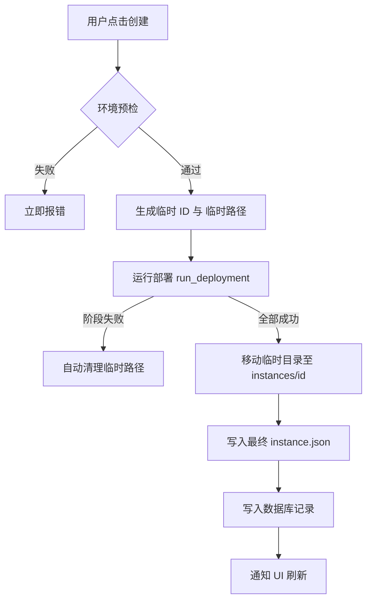

# 实例部署原子化优化方案 (方案二)

## 1. 背景与现状分析
在当前的 PiLauncher 实现中，实例部署采用的是“预创建”模式：
- 在开始下载和部署核心组件之前，程序会立即创建实例文件夹、生成 `instance.json` 并将其写入数据库。
- 这种方式虽然能让 UI 立即感知到新实例，但如果部署过程中途失败（如网络中断、磁盘空间不足等），会导致磁盘上留下半成品的空文件夹，且数据库中存在无效的实例记录。

## 2. 核心设计：原子化部署 (Atomic Deployment)
为了确保实例创建的完整性，建议采用原子化部署方案，即：**要么完全成功并持久化，要么完全失败且不留痕迹。**

### 2.1 延迟持久化 (Delayed Persistence)
将实际的文件夹创建和数据库写入动作推迟到部署流程的最后阶段。

- **临时工作空间**：在系统临时目录或 `instances/.tmp` 下创建一个唯一的临时工作文件夹。
- **沙盒部署**：所有的文件下载（Core, Libraries, Loader）和配置生成先在临时空间中完成。
- **一键提交 (Commit)**：
    1. 当所有阶段（VANILLA_CORE, LOADER_CORE, MANIFEST_BUILD）均成功完成后。
    2. 将临时文件夹重命名/移动到最终的 `instances/{id}` 位置。
    3. 最后一步执行数据库 `upsert` 操作，使实例在 UI 中正式可见。

### 2.2 预检机制 (Pre-flight Checks)
在正式启动部署线程之前，增加更严格的静态校验，避免在已知必败的情况下启动流程：
- **版本可用性校验**：预先检查所选的 Minecraft 版本和 Loader 版本组合是否有效。
- **磁盘空间预估**：根据元数据预估所需空间，防止在下载大文件时因磁盘爆满而中断。
- **环境检查**：检查 Java 运行时环境是否可用，避免部署完成后无法启动的问题。

## 3. 实施流程图

## 4. 方案优势
1. **零残留**：部署失败不会产生任何“僵尸文件夹”或“空白实例”。
2. **状态一致性**：数据库记录与物理文件同步产生，保证了数据的最终一致性。
3. **用户体验**：减少了用户手动清理失败实例的负担，提升了软件的专业感。

## 5. 待办事项 (Implementation Notes)
- 修改 `InstanceCreationService::create` 以支持临时路径。
- 实现 `fs::rename` 或跨盘拷贝逻辑（针对不同分区的情况）。
- 确保清理逻辑在程序崩溃或被强杀时也能通过下次启动时的扫描进行自动回收。
