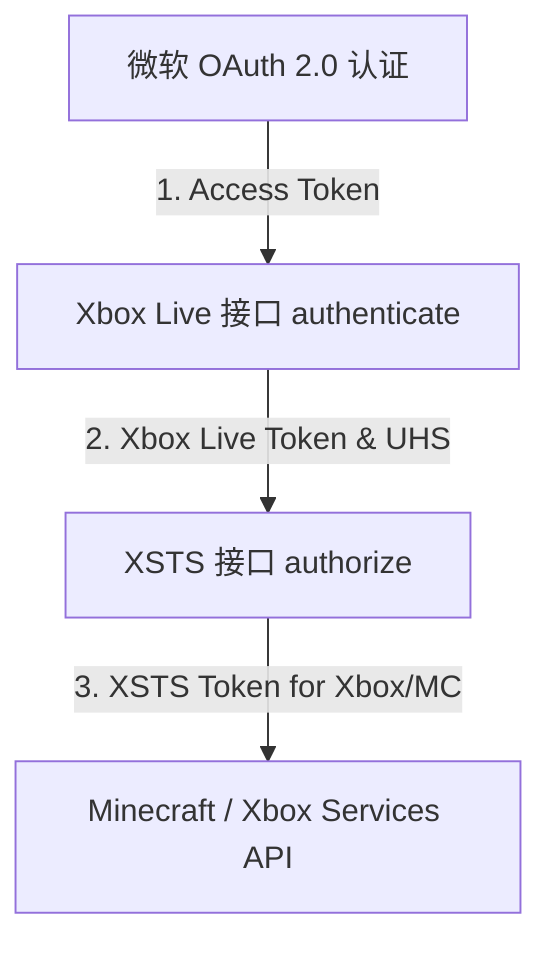

# Xbox & Minecraft Services Web API 开发者文档

本文档收录了目前可用的官方 **Xbox Live** 与 **Minecraft Services** 的 Web API（含公开和需要用户登录认证的接口）。这对于开发自定义启动器、联机辅助工具、社交看板或管理类应用极具参考价值。

---

## 目录

- [1. 微软账户与 Xbox Live 统一认证链](#1-微软账户与-xbox-live-统一认证链)
  - [步骤 1：获取微软 OAuth 2.0 访问令牌](#步骤-1获取微软-oauth-20-访问令牌)
  - [步骤 2：使用微软 token 换取 Xbox Live Token](#步骤-2使用微软-token-换取-xbox-live-token)
  - [步骤 3：获取 XSTS 授权令牌](#步骤-3获取-xsts-授权令牌)
- [2. Minecraft 账户登录认证](#2-minecraft-账户登录认证)
  - [步骤 4：用 XSTS 换取 Minecraft Bearer Token](#步骤-4用-xsts-换取-minecraft-bearer-token)
- [3. Minecraft Services API (需要 MC 登录)](#3-minecraft-services-api-需要-mc-登录)
  - [3.1 获取个人档案 (Profile)](#31-获取个人档案-profile)
  - [3.2 检查游戏所有权 (Entitlements)](#32-检查游戏所有权-entitlements)
  - [3.3 检查角色名是否可用](#33-检查角色名是否可用)
  - [3.4 更改游戏内角色名](#34-更改游戏内角色名)
  - [3.5 上传/更改皮肤](#35-上传更改皮肤)
  - [3.6 切换已拥有的皮肤/披风](#36-切换已拥有的皮肤披风)
- [4. Xbox Live Services API (需要 Xbox XSTS 登录)](#4-xbox-live-services-api-需要-xbox-xsts-登录)
  - [4.1 获取指定 XUID 玩家的 Profile 设定](#41-获取指定-xuid-玩家的-profile-设定)
  - [4.2 根据 Gamertag 查玩家 Profile 设定](#42-根据-gamertag-查玩家-profile-设定)
  - [4.3 获取好友列表及在线状态 (PeopleHub)](#43-获取好友列表及在线状态-peoplehub)
  - [4.4 获取玩家在线状态及当前游戏 (Presence)](#44-获取玩家在线状态及当前游戏-presence)
- [5. 官方公开的 Mojang / Minecraft API (无需登录)](#5-官方公开的-mojang--minecraft-api-无需登录)
  - [5.1 玩家名转 UUID](#51-玩家名转-uuid)
  - [5.2 批量玩家名转 UUID](#52-批量玩家名转-uuid)
  - [5.3 根据 UUID 获取玩家 Profile 与皮肤/披风纹理](#53-根据-uuid-获取玩家-profile-与皮肤披风纹理)
  - [5.4 Mojang 官方服务状态检查](#54-mojang-官方服务状态检查)
- [6. 社区第三方公开 API 推荐 (服务器查询等)](#6-社区第三方公开-api-推荐-服务器查询等)

---

## 1. 微软账户与 Xbox Live 统一认证链

在调用受保护的接口前，必须先获取相应的 Token。微软提供了标准的 **OAuth 2.0**，并在其上叠加了 Xbox Live (XBL) 与 XSTS 授权。



### 步骤 1：获取微软 OAuth 2.0 访问令牌

> [!NOTE]
> 启动器最常用的是 **设备码流程 (Device Code Flow)**，而 Web 端则通常采用 **授权码流程 (Authorization Code Flow)**。

*   **OAuth 2.0 设备码下发**
    *   **Endpoint**: `POST https://login.microsoftonline.com/consumers/oauth2/v2.0/devicecode` (或使用通用租户 `common`)
    *   **Content-Type**: `application/x-www-form-urlencoded`
    *   **参数**:
        ```properties
        client_id=YOUR_CLIENT_ID
        scope=service::user.auth.xboxlive.com::MBI_SSL openid offline_access
        ```
    *   **返回**: 包含 `user_code`（浏览器输入码）、`verification_uri`（验证网址）和 `device_code`（轮询凭证）。

*   **OAuth 2.0 轮询 Token**
    *   **Endpoint**: `POST https://login.microsoftonline.com/consumers/oauth2/v2.0/token`
    *   **Content-Type**: `application/x-www-form-urlencoded`
    *   **参数**:
        ```properties
        client_id=YOUR_CLIENT_ID
        grant_type=urn:ietf:params:oauth:grant-type:device_code
        device_code=YOUR_DEVICE_CODE
        ```
    *   **返回**: 成功后包含 `access_token` 和 `refresh_token`。

---

### 步骤 2：使用微软 token 换取 Xbox Live Token

*   **Endpoint**: `POST https://user.auth.xboxlive.com/user/authenticate`
*   **Content-Type**: `application/json`
*   **Accept**: `application/json`
*   **请求体**:
    ```json
    {
      "Properties": {
        "AuthMethod": "RPS",
        "SiteName": "user.auth.xboxlive.com",
        "RpsTicket": "d=<微软 OAuth Access Token>" 
      },
      "RelyingParty": "http://auth.xboxlive.com",
      "TokenType": "JWT"
    }
    ```
*   **返回示例**:
    ```json
    {
      "IssueInstant": "2026-05-22T12:00:00Z",
      "NotAfter": "2026-06-05T12:00:00Z",
      "Token": "EwB4Aq...（长 token 字符串）",
      "DisplayClaims": {
        "xui": [
          {
            "uhs": "1234567890abcdef"
          }
        ]
      }
    }
    ```
    > [!IMPORTANT]
    > 提取返回体中 `DisplayClaims.xui[0].uhs` (User Hash) 和 `Token`。接下来的请求中必须配合使用这两个字段。

---

### 步骤 3：获取 XSTS 授权令牌

有了 Xbox Live Token 后，需要为具体的下游服务申请 **XSTS Token**。不同的下游服务依靠不同的 `RelyingParty`（依赖方标识）来区分。

*   **Endpoint**: `POST https://xsts.auth.xboxlive.com/xsts/authorize`
*   **Content-Type**: `application/json`
*   **请求体**：
    ```json
    {
      "Properties": {
        "SandboxId": "RETAIL",
        "UserTokens": [
          "<步骤2中获取的 Xbox Live Token>"
        ]
      },
      "RelyingParty": "<目标依赖方 URL>",
      "TokenType": "JWT"
    }
    ```

| 依赖方服务类型 | `RelyingParty` 取值 | 用途说明 |
| :--- | :--- | :--- |
| **Minecraft Services** | `rp://api.minecraftservices.com/` | 用于登录 Java 版 Minecraft，管理皮肤披风等。 |
| **Xbox Live Core API** | `http://xboxlive.com` | 用于查询 Xbox 好友、个人主页、成就和在线状态。 |

*   **返回结构**: 与步骤 2 完全类似，会生成一个特定针对该 RelyingParty 的 `Token` 和 `uhs`。

---

## 2. Minecraft 账户登录认证

如果您正在开发 Minecraft 启动器，使用这一步来获得游戏运行时所需的 Bearer Access Token。

### 步骤 4：用 XSTS 换取 Minecraft Bearer Token

*   **Endpoint**: `POST https://api.minecraftservices.com/authentication/login_with_xbox`
*   **Content-Type**: `application/json`
*   **请求体**:
    ```json
    {
      "identityToken": "XBL3.0 x=<uhs>;<XSTS_Token>"
    }
    ```
    *(注意：`identityToken` 的格式非常严格，必须在 `uhs` 前面拼上 `XBL3.0 x=`)*
*   **返回体**:
    ```json
    {
      "username": "xxxxxxxx-xxxx-xxxx-xxxx-xxxxxxxxxxxx",
      "roles": [],
      "access_token": "eyJhbGciOi...", 
      "token_type": "Bearer",
      "expires_in": 86400
    }
    ```
    提取 `access_token`，在之后所有的 Minecraft Services 接口中作为 `Authorization: Bearer <access_token>` 请求头发送。

---

## 3. Minecraft Services API (需要 MC 登录)

以下接口均使用 **Minecraft Bearer Token** 作为授权。请求时需附带 Header:
`Authorization: Bearer <Minecraft Bearer Token>`

### 3.1 获取个人档案 (Profile)

返回当前登录玩家的 UUID、名字、当前生效的皮肤和披风。

*   **Method**: `GET`
*   **Endpoint**: `https://api.minecraftservices.com/minecraft/profile`
*   **响应示例**:
    ```json
    {
      "id": "4a7da88c9cfc4d44aa52cf6621fb7a64",
      "name": "Steve",
      "skins": [
        {
          "id": "e9365e90-c24c-473d-82d8-21d31fa013ec",
          "state": "ACTIVE",
          "url": "http://textures.minecraft.net/texture/3bb58e...",
          "variant": "CLASSIC"
        }
      ],
      "capes": [
        {
          "id": "2d8cb30f-b44c-4cc0-84a8-422cfb9b8b80",
          "state": "ACTIVE",
          "url": "http://textures.minecraft.net/texture/a35d9a...",
          "alias": "Migrator"
        }
      ]
    }
    ```

### 3.2 检查游戏所有权 (Entitlements)

验证该微软账户是否已购买 Minecraft。

*   **Method**: `GET`
*   **Endpoint**: `https://api.minecraftservices.com/entitlements/mcstore`
*   **响应示例**:
    ```json
    {
      "items": [
        {
          "name": "game_minecraft",
          "signature": "..."
        },
        {
          "name": "product_minecraft",
          "signature": "..."
        }
      ]
    }
    ```
    > [!TIP]
    > 如果 `items` 列表为空，代表该账号未购买正版游戏，启动器应禁止其登录正版联机服务器。

### 3.3 检查角色名是否可用

在注册新账号或更改角色名时，检查名称是否已被占用。

*   **Method**: `GET`
*   **Endpoint**: `https://api.minecraftservices.com/minecraft/profile/name/<欲检查的用户名>/available`
*   **响应示例**:
    ```json
    {
      "status": "AVAILABLE" // 或 "DUPLICATE", "NOT_ALLOWED"
    }
    ```

### 3.4 更改游戏内角色名

*   **Method**: `PUT`
*   **Endpoint**: `https://api.minecraftservices.com/minecraft/profile/name/<新用户名>`
*   **响应**: 成功返回 `200 OK` 及更新后的 Profile JSON。

### 3.5 上传/更改皮肤

*   **Method**: `POST`
*   **Endpoint**: `https://api.minecraftservices.com/minecraft/profile/skins`
*   **Content-Type**: `multipart/form-data`
*   **参数**:
    *   `variant`: `classic` 或 `slim`
    *   `file`: 皮肤 PNG 文件的二进制数据
*   **响应**: 成功返回 `200 OK`，更新角色全局皮肤文件。

### 3.6 切换已拥有的皮肤/披风

*   **激活指定皮肤/披风**
    *   **Method**: `PUT`
    *   **Endpoint (皮肤)**: `https://api.minecraftservices.com/minecraft/profile/skins/active`
    *   **Endpoint (披风)**: `https://api.minecraftservices.com/minecraft/profile/capes/active`
    *   **请求体**:
        *   皮肤: `{"variant": "classic", "url": "皮肤材质地址"}`
        *   披风: `{"capeId": "披风UUID"}`
*   **重置/隐藏当前披风或皮肤**
    *   **Method**: `DELETE`
    *   **Endpoint (皮肤)**: `https://api.minecraftservices.com/minecraft/profile/skins/active`
    *   **Endpoint (披风)**: `https://api.minecraftservices.com/minecraft/profile/capes/active`

---

## 4. Xbox Live Services API (需要 Xbox XSTS 登录)

以下接口均使用 **Xbox 专属的 XSTS Token**。请求时必须附带如下 Header：
*   `Authorization`: `XBL3.0 x=<uhs>;<XSTS_Token>`
*   `x-xbl-contract-version`: `2` (或特定版本号，用于协商 Xbox API 版本)
*   `Content-Type`: `application/json`

### 4.1 获取指定 XUID 玩家的 Profile 设定

XUID (Xbox Unique Identifier) 是 Xbox Live 体系中的唯一长整数 ID。

*   **Method**: `GET`
*   **Endpoint**: `https://profile.xboxlive.com/users/xuid(<目标用户XUID>)/profile/settings`
*   **参数**: `settings=GameDisplayName,AppDisplayName,AppDisplayPicRaw,GameDisplayPicRaw,Gamertag,Gamerscore,Bio`
*   **响应示例**:
    ```json
    {
      "profileUsers": [
        {
          "id": "2535400000000000",
          "settings": [
            { "id": "Gamertag", "value": "MajorNelson" },
            { "id": "GameDisplayName", "value": "Nelson" },
            { "id": "GameDisplayPicRaw", "value": "http://images-eds.xboxlive.com/..." },
            { "id": "Gamerscore", "value": "150000" }
          ]
        }
      ]
    }
    ```

### 4.2 根据 Gamertag 查玩家 Profile 设定

此接口可以直接通过 Xbox 玩家代号（Gamertag）查询其 XUID 及基本 Profile 数据，常用于添加好友前的用户搜索。

*   **Method**: `GET`
*   **Endpoint**: `https://profile.xboxlive.com/users/gt(<目标用户Gamertag>)/profile/settings`
*   **参数**: `settings=Gamertag` (或同上)

### 4.3 获取好友列表及在线状态 (PeopleHub)

PeopleHub 是微软官方聚合社交关系的平台，可一次性拉取好友名单、备注名与在线状态详情。

*   **Method**: `GET`
*   **Endpoint**: `https://peoplehub.directory.xboxlive.com/users/xuid(<我的XUID>)/people/social/decoration/detail,presenceDetail`
*   **响应示例**:
    ```json
    {
      "people": [
        {
          "xuid": "2535400000000001",
          "gamertag": "FriendGamertag",
          "displayName": "Alex",
          "presenceState": "Online",
          "presenceDetails": [
            {
              "deviceType": "Win32",
              "presenceText": "Minecraft",
              "titleId": "19435432"
            }
          ]
        }
      ]
    }
    ```

### 4.4 获取玩家在线状态及当前游戏 (Presence)

*   **查询单个玩家状态**
    *   **Method**: `GET`
    *   **Endpoint**: `https://presence.xboxlive.com/users/xuid(<目标用户XUID>)`
*   **批量查询玩家状态**
    *   **Method**: `POST`
    *   **Endpoint**: `https://presence.xboxlive.com/users/batch`
    *   **请求体**:
        ```json
        {
          "users": ["2535400000000001", "2535400000000002"]
        }
        ```

---

## 5. 官方公开的 Mojang / Minecraft API (无需登录)

用于进行快速的公共信息查询，这些接口不需要用户登录，无 Authorization 请求头要求（但有较严格的 IP 速率限制，如 10 分钟最多请求 600 次）。

### 5.1 玩家名转 UUID

将当前最新的 Minecraft 角色名转换为去掉连字符（Dashes）的 32 位 UUID 格式。

*   **Method**: `GET`
*   **Endpoint**: `https://api.mojang.com/users/profiles/minecraft/<角色名>`
*   **响应**:
    ```json
    {
      "id": "069a79f444e94726a5befca90e38aaf5",
      "name": "Notch"
    }
    ```

### 5.2 批量玩家名转 UUID

*   **Method**: `POST`
*   **Endpoint**: `https://api.mojang.com/profiles/minecraft`
*   **Content-Type**: `application/json`
*   **请求体**: `["Notch", "Steve", "Alex"]`
*   **响应**: 数组结构，返回已查到的玩家 UUID 和当前名。

### 5.3 根据 UUID 获取玩家 Profile 与皮肤/披风纹理

根据 32 位 UUID 获取玩家的全部外观元数据。

*   **Method**: `GET`
*   **Endpoint**: `https://sessionserver.mojang.com/session/minecraft/profile/<玩家UUID>?unsigned=false`
*   **响应示例**:
    ```json
    {
      "id": "069a79f444e94726a5befca90e38aaf5",
      "name": "Notch",
      "properties": [
        {
          "name": "textures",
          "value": "eyJ0aW1lc3RhbXAiOjE...", // Base64 编码的皮肤材质元数据
          "signature": "C3g8f..." // 微软服务器安全签名
        }
      ]
    }
    ```
    > [!TIP]
    > 解码 `value` 对应的 Base64 数据后，可得到形如：
    > `{"textures":{"SKIN":{"url":"http://textures.minecraft.net/texture/..."}}}` 的直接图片 URL，可用在客户端皮肤渲染器（如 Skinview3d）中。

### 5.4 Mojang 官方服务状态检查

查询 Mojang/Minecraft 各个后端服务器是否正常运行。

*   **Method**: `GET`
*   **Endpoint**: `https://status.mojang.com/check`
*   **响应示例**:
    ```json
    [
      { "api.mojang.com": "green" },
      { "session.minecraft.net": "green" },
      { "textures.minecraft.net": "red" }
    ]
    ```

---

## 6. 社区第三方公开 API 推荐 (服务器查询等)

如果您需要获取 Minecraft 服务器的实时状态（人数、图标、MOTD），通常使用标准的 **Minecraft Server List Ping (SLP)** 协议。若不想在本地实现底层网络解析，可调用以下公开的 Web REST API。

*   **mcsrvstat.us API (推荐，完全免费且稳定)**
    *   **Java 版服务器**: `GET https://api.mcsrvstat.us/2/<服务器IP>:<端口>`
    *   **Bedrock 版服务器**: `GET https://api.mcsrvstat.us/bedrock/2/<服务器IP>:<端口>`
    *   **返回**: 包含玩家列表、在线人数上限、MOTD 图文解码及 favicon (base64格式)。

*   **mcstatus.io API**
    *   **Java 版**: `GET https://api.mcstatus.io/v2/status/java/<服务器IP>:<端口>`
    *   **Bedrock 版**: `GET https://api.mcstatus.io/v2/status/bedrock/<服务器IP>:<端口>`
