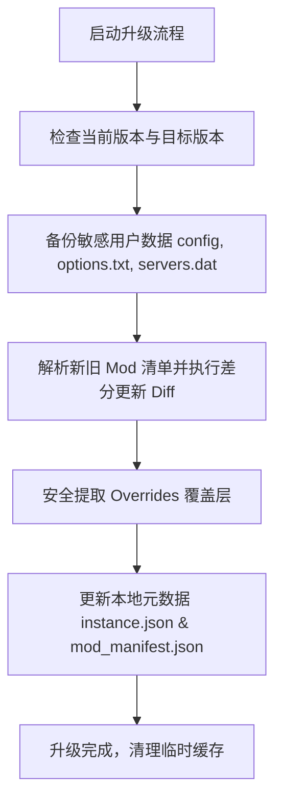

# 整合包版本升级与用户数据保留指南

在 Minecraft 启动器中，整合包的升级是一个常见且高频的需求。如何让玩家在升级整合包（从旧版本到新版本）时，既能享受到作者更新的模组、配置文件和游戏内容，又**绝对不丢失本地的存档、截图、按键映射、画质设置及自定义模组等用户数据**，是提升用户体验的核心关键。

本指南将从 **文件分类定义**、**启动器升级技术方案** 以及 **整合包作者打包最佳实践** 三个维度，详细阐述如何实现无损的“完美升级”。

---

## 1. 实例目录下的文件角色分类

在实施升级方案前，必须明确 Minecraft 实例根目录（如 `.minecraft` 或自定义实例目录）中各个文件和文件夹的归属权。

我们可以将这些文件分为三大类：

| 文件/文件夹 | 角色归属 | 升级时的处理策略 | 包含的关键数据 |
| :--- | :--- | :--- | :--- |
| `saves/` | **玩家个人数据** | **绝对禁止覆盖或删除** | 单人游戏存档、地图数据 |
| `screenshots/` | **玩家个人数据** | **绝对禁止覆盖或删除** | 游戏内截图 |
| `options.txt` | **玩家个人数据** | **禁止覆盖（使用默认选项机制替代）**| 玩家按键绑定、音量、画质、视距设置 |
| `servers.dat` | **玩家个人数据** | **禁止覆盖** | 玩家添加的多人服务器列表 |
| `optionsof.txt` | **玩家个人数据** | **禁止覆盖** | OptiFine 的画质设置（若有） |
| `options.txt.fml` | **玩家个人数据** | **禁止覆盖** | Forge 相关的配置状态 |
| `shaderpacks/` | **混合归属** | **增量同步，保留玩家自定义** | 光影包。合并作者更新与玩家自定义 |
| `resourcepacks/`| **混合归属** | **增量同步，保留玩家自定义** | 资源包/材质包。合并作者与玩家自定义 |
| `mods/` | **混合归属** | **严格差分对比（Diff）更新** | 游戏模组。仅删改属于整合包的 Mod，保留用户手动添加的 Mod |
| `config/` | **整合包数据** | **备份并覆盖升级** | 模组配置文件（如平衡性、按键默认冲突修复） |
| `scripts/` | **整合包数据** | **完全清空并覆盖升级** | KubeJS、CraftTweaker 等魔改脚本（属于整合包代码） |
| `local/` | **整合包数据** | **完全覆盖升级** | 整合包专属本地化或任务数据（如 FTB Quests） |
| `patchouli_books/`| **整合包数据** | **完全覆盖升级** | 帕秋莉手册自定义内容 |

---

## 2. 启动器无损升级技术设计方案

当玩家通过启动器（如 PiLauncher）对已部署的实例进行升级时，启动器应当执行以下标准的“安全升级工作流”：



### 2.1 第一步：自动备份敏感数据
在对文件进行任何写操作前，启动器应在实例的 `.backups/` 目录下创建一个临时备份。
- **备份内容**：`config/` 目录、`options.txt`、`servers.dat`。
- **作用**：若升级过程中途断电、报错，或升级后游戏因配置冲突无法启动，玩家可一键回滚。

### 2.2 第二步：模组差分更新（Mod Diff）
启动器绝对不能直接清空 `mods/` 文件夹，因为玩家可能自己往里面添加了辅助模组（如光影优化、小地图、HUD等）。

启动器应当利用本地维护的清单文件 `mod_manifest.json`（PiLauncher 采用的机制）进行精细化差分：
1. **识别来源**：
   - 具有 `kind: "ModpackDeployment"` 的模组为整合包自带模组。
   - 具有 `kind: "ExternalImport"` 或 `kind: "LauncherDownload"` 的模组为玩家自定义添加的模组。
2. **执行差分（Diff）算法**：
   - **要删除的模组**：存在于旧版整合包清单中，但**不存在**于新版整合包清单中的 `ModpackDeployment` 模组。
   - **要新增/更新的模组**：存在于新版整合包清单中，但本地不存在或哈希值（SHA-1）不一致的模组。
   - **保留的模组**：玩家自定义添加的模组（不包含在旧版整合包清单中，且 `kind` 不是 `ModpackDeployment`）应当被**无条件保留**。

### 2.3 第三步：选择性提取覆盖层（Selective Overrides）
整合包压缩包（Modrinth 的 `.mrpack` 或 CurseForge 的 `.zip`）中通常包含一个 `overrides/` 目录，用于放置配置文件。在提取该目录时，必须遵循以下安全策略：

1. **白名单/黑名单过滤**：
   - **黑名单（绝对禁止覆盖）**：提取过程中，遇到路径为 `saves/`、`screenshots/`、`options.txt`、`servers.dat` 的文件时，**直接跳过**，不允许压缩包内的同名文件覆盖本地用户数据。
2. **配置文件（config）版本更新策略**：
   - 整合包更新往往伴随着 `config/` 下配置的位置或内容修改（如修复崩溃、调整配方平衡性）。
   - **策略**：直接覆盖。但在覆盖前，如果检测到本地已存在同名配置文件，且其修改时间（mtime）与旧版整合包部署时的初始状态不同（说明玩家手动微调过配置），建议在升级成功后给予提示，或者直接在备份目录中保留该文件的备份。
3. **合并资源包与光影包**：
   - 提取 `resourcepacks/` 和 `shaderpacks/` 时，执行**增量覆盖**。仅替换整合包自带的资源包，不删除玩家自己放进去的其他资源包。

### 2.4 第四步：同步本地状态与元数据
升级完成后，启动器需要更新本地的元数据：
- 更新 `instance.json` 中的 `version` 字段为新版本号。
- 将新下载的模组在 `mod_manifest.json` 中标记为 `ModpackDeployment`，并更新其哈希和状态。

### 2.5 第五步：游戏版本与 Loader 升级处理

当整合包更新涉及 **游戏版本（Minecraft Version）** 或 **加载器版本（Loader Version，如 Forge/Fabric/NeoForge/Quilt 版本）** 的变更时，启动器需要执行以下关键逻辑：

1. **元数据比对与更新**：
   - 启动器解析新版本整合包中的清单，提取 `minecraft` 版本和 `loader` 版本。
   - 如果发现版本变更，启动器更新 `instance.json` 中关联的启动版本配置（如指定新版本的 Forge 运行库或 Fabric 加载器）。
2. **加载器核心库依赖下载**：
   - 启动器根据新版本配置，提前下载并配置对应版本的 Minecraft 基础 Jar 包、新版加载器（Loader）安装程序及底层库依赖文件（Libraries）。
3. **跨主要游戏版本的“强提醒”与世界归档保护**：
   - **小版本升级（如仅 Loader 升级，或 1.20.1 升级到 1.20.2）**：通常向下兼容，可以直接执行升级，无需阻断玩家。
   - **大版本/跨世代升级（如 1.16.5 升级到 1.20.1）**：模组与存档格式发生剧变，直接原位覆盖升级极易导致世界损坏。
     - **安全策略**：启动器应弹出警告窗口，告知玩家“检测到游戏主版本发生重大更新，直接升级可能导致已有存档损坏”，并提供以下两个选项：
       - **新建实例（推荐）**：保留旧版实例不变，新建一个新版本整合包实例。
       - **强行原位升级（自动备份存档）**：在开始升级前，必须将旧实例中的 `saves/` 单独打包备份（如保存到 `.backups/worlds/` 下），再强行覆盖升级。
4. **运行环境（Java Runtime）自动适配**：
   - 伴随着游戏版本或加载器的升级，往往需要不同版本的 Java。例如，Minecraft 1.12.2 使用 Java 8，而 1.17+ 使用 Java 17，1.20.5+ 使用 Java 21。
   - **策略**：启动器必须根据新的游戏版本和 Loader 兼容矩阵，自动检测、下载并切换调用对应的正确 Java 运行时版本，防止因玩家本地 Java 版本不兼容导致升级后无法启动或崩溃。

---

## 3. 整合包作者打包最佳实践（解决配置冲突）

仅靠启动器底层的保护是不够的，如果整合包作者在打包时将个人配置写死了，依然会导致玩家升级后体验下降（例如强制覆盖按键）。因此，作者应配合采用以下打包规范：

### 3.1 使用 Default Options 模组管理按键与设置（强烈推荐）
如果作者直接将修改过的 `options.txt` 放入整合包的 `overrides` 中，启动器在升级时为了保护玩家的自定义键位，通常会选择“不覆盖 `options.txt`”，这会导致作者新加入的模组按键冲突无法得到自动修复。

**完美解决方案**：
1. 整合包内引入 [Default Options](https://www.curseforge.com/minecraft/mc-mods/default-options) 模组（支持 Forge/Fabric/NeoForge）。
2. 作者配置好默认的键位和游戏设置后，在开发环境中运行命令 `/defaultoptions save`。
3. 这会将当前的键位和选项保存到 `config/defaultoptions/` 目录下的 `options.txt` 和 `keybindings.txt` 中。
4. **打包发布时**：
   - 整合包的 `overrides/` 目录中**不包含**根目录下的 `options.txt`。
   - 仅包含 `config/defaultoptions/` 下的默认配置文件。
5. **玩家升级效果**：
   - 升级时，玩家根目录下的 `options.txt` 不会被覆盖，原有的键位和画质设置完美保留。
   - `Default Options` 模组会在游戏启动时，自动将作者更新的默认按键（在 `keybindings.txt` 中）与玩家个人的 `options.txt` 进行**智能合并**，仅修复新冲突或应用新默认值，而不覆盖玩家已修改过的个人键位。

### 3.2 避免打包冗余文件
作者在导出/打包整合包时，应确保过滤掉以下玩家/开发环境特有的临时文件和数据：
- **绝对禁止包含**：
  - `saves/*`（除非是展示用的预设地图/推介图）
  - `screenshots/*`
  - `logs/*` 和 `crash-reports/*`
  - `options.txt`（请使用 3.1 节方案）
  - `servers.dat`（若需要内置服务器，请改用内置服务器列表模组，如 *Server Lister* 或放置在 `config/defaultoptions/` 中）
  - `webdav_sync` 等同步插件的配置
- **建议过滤**：
  - `.mixin.out/`
  - 模组的临时运行缓存（如 `.canvas/`，`.ir/` 等）

## 4. 启动器升级入口设计（UI/UX）

为了提供丝滑的升级体验，启动器在界面设计上应提供三个主要的升级触发入口：

### 4.1 入口一：实例详情页概览面板（Overview Panel）
- **触发场景**：玩家已进入某个已安装实例的详情页。
- **UI 呈现**：
  - 启动器后台静默比对云端最新版本号与本地 `instance.json` 中的 `version`。
  - 若检测到新版本，在“开始游戏”按钮下方或版本号标签旁，展示带动画效果的 **“可升级至 vX.Y.Z” 徽章**，并提供一个独立的 **“升级整合包” 按钮**。
  - 点击按钮触发 `ModpackUpgradeModal` 弹窗。

### 4.2 入口二：本地实例卡片右键菜单（Context Menu）
- **触发场景**：玩家在主界面的本地实例列表中浏览。
- **UI 呈现**：
  - 右键点击该整合包实例卡片（或使用手柄选中时按菜单键），在弹出的上下文菜单中展示 **“升级此整合包”** 选项（仅在检测到新版本时亮起或显示红点提示）。

### 4.3 入口三：整合包下载市场 / 新建实例页（Market Redirection）
- **触发场景**：玩家在整合包下载页（如 CurseForge/Modrinth 市场）重新搜索到该整合包，并点击“安装”或“下载”。
- **UI 呈现**：
  - 启动器检测到本地已存在基于该整合包 UUID 部署的实例。
  - 弹出二次确认弹窗：
    > **检测到已安装实例**
    >
    > 您已拥有该整合包的实例 `[实例名称] (v1.0.0)`。请选择您的操作：
    > - **升级当前实例**（保留现有存档、个人设置与游戏时长）
    > - **新建独立实例**（部署为全新的独立客户端）

---

## 5. 编码目录结构设计

为了在代码库中清晰地解耦“升级”逻辑，建议在 `pilauncher` 中采用以下的前后端编码目录结构设计：

### 5.1 后端目录结构 (Rust / Tauri)
升级的核心逻辑由 Rust 负责，以保证文件 I/O 的高性能与安全性。

```text
src-tauri/
├── src/
│   ├── commands/
│   │   ├── mod.rs                # 注册并导出 tauri 命令行接口
│   │   └── modpack_cmd.rs        # [修改] 增加 check_modpack_update / upgrade_modpack 命令
│   │
│   ├── domain/
│   │   ├── modpack.rs            # 定义 ModpackUpgradeInfo 元数据结构体
│   │   └── mod_manifest.rs       # 模组清单的数据模型
│   │
│   └── services/
│       ├── instance/
│       │   └── backup_service.rs # [新建] 通用备份逻辑：将 saves/config/options.txt 打包为 zip
│       │
│       └── modpack_service/      # 整合包服务核心目录
│           ├── mod.rs            # 模块入口，暴露 upgrade_instance 接口
│           ├── logic.rs          # 纯逻辑计算（新旧清单 Diff，过滤黑名单路径）
│           ├── ops.rs            # 文件基础读写操作（提取文件，覆盖 config）
│           ├── orchestrator.rs   # 核心工作流调度器（下载、安装）
│           └── upgrade.rs        # [新建] 升级业务调度器（编排：备份 -> 差分 -> 提取覆盖 -> 更新元数据）
```

### 5.2 前端目录结构 (React / TypeScript)
前端负责状态展示、版本比对、升级配置交互以及进度条的渲染。

```text
src/
├── features/
│   └── InstanceDetail/
│       ├── components/
│       │   ├── tabs/
│       │   │   └── OverviewPanel.tsx      # [修改] 集成“升级”按钮，触发升级模态框
│       │   │
│       │   └── modpack/
│       │       └── ModpackUpgradeModal.tsx # [新建] 升级配置弹窗（展示更新日志、选择备份模式、渲染升级进度条）
│       │
│       └── hooks/
│           └── useModpackUpgrade.ts       # [新建] 封装升级 Hook，管理状态（空闲/备份中/下载中/解压中/完成/失败）
│
└── store/
    └── useInstanceStore.ts                # 本地实例状态管理库，更新升级后的实例列表
```

---

## 6. 异常回滚机制建议

在极少数情况下，升级后的整合包可能因为 Java 版本不兼容、新版模组致命 Bug 等原因导致无法启动或存档损坏。

启动器应提供 **一键回滚** 功能：
1. **备份路径定位**：前往该实例的 `.backups/upgrade-<timestamp>/` 目录。
2. **恢复策略**：
   - 将当前崩溃的 `config/` 替换回备份的旧 `config/`。
   - 恢复旧版的 `mods/` 目录清单（可通过启动器重新下载旧版本，或如果空间允许，从本地备份中恢复）。
   - 将元数据版本号写回旧版本。
3. **提示玩家**：引导玩家在社区反馈 Bug，同时保证其本地单人存档处于未损坏的安全状态。
